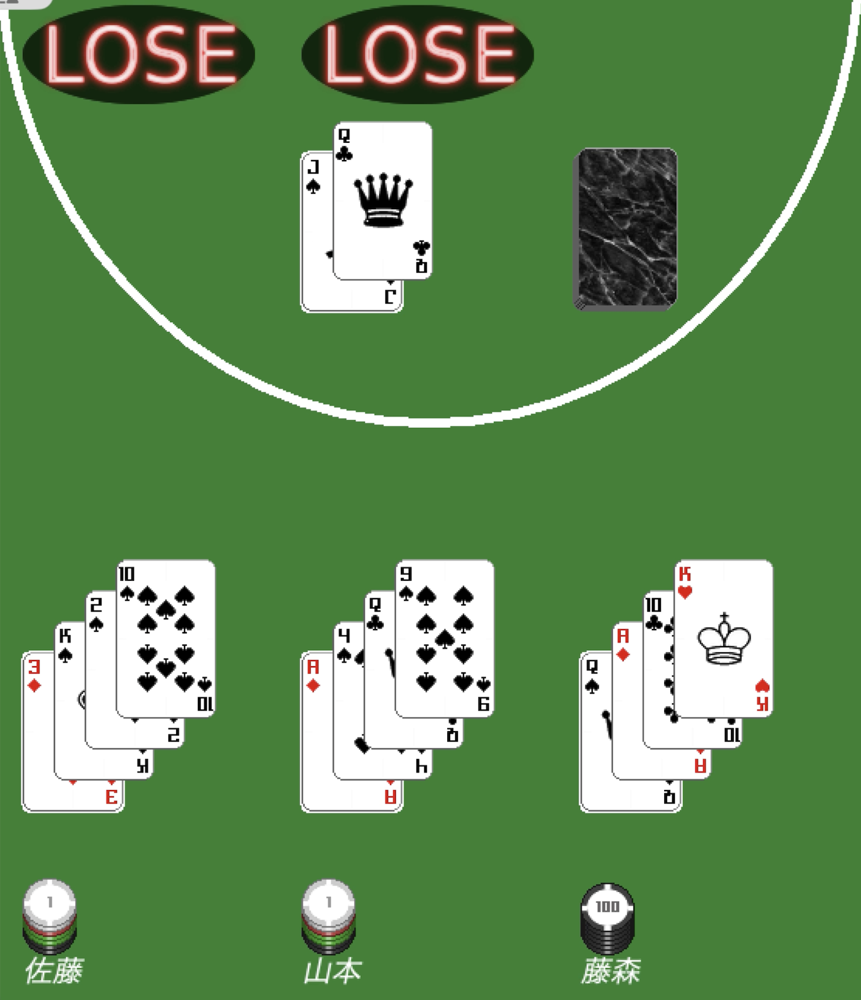

# ブラックジャックゲーム



大学1年次にJava で実装した GUI ベースのブラックジャックゲームです。  

GUI は `Swing` と `AWT` の両方に対応しており、戦略クラスによるエージェントプレイヤー機構を取り入れ、拡張しやすい構成を意識して設計しました。

## 概要

- `Swing` と `AWT` の両方で動作
- 人間プレイヤーとエージェントプレイヤーの両方に対応
- 複数の戦略クラスを切り替えて対戦可能
- チップ管理、勝敗判定、バナー表示までを含む一連のゲーム進行を実装

## 使用技術

- Java
- Maven
- Swing / AWT
- JUnit4

## 起動方法

##### Maven環境の方:

Swing で起動する場合:

```bash
mvn compile exec:java
```

AWT で起動する場合:

```bash
mvn compile exec:java -Dapp.gui=AWT
```

##### その他の方:

その他の方は Github の Releases から blackjack.jar をダウンロード後、以下を実行。
```bash
java -jar blackjack.jar
```

## ゲーム仕様

このプロジェクトでは、次の仕様でゲームが進行します。

- ディーラー 1 人と各プレイヤーが対戦
- 各プレイヤーはゲーム参加時に名前、所持チップ数、人間/エージェントを設定
- エージェントを選んだ場合は戦略を選択可能
- ベット後、各プレイヤーに 2 枚、ディーラーに 2 枚配札
- プレイヤーは Hit / Stand を選択
- 手札合計が 21 を超えるとバースト
- 清算時は勝ち / 引き分け / 負け / ブラックジャックで倍率を変えて報酬を計算

## エージェント戦略

エージェントプレイヤーは、参加時に複数の戦略から選択できます。
戦略ごとに、主に次の 2 つを決定します。

- いくらベットするか
- 現在の手札で Hit するか Stand するか

`DynamicStrategy` は状況に応じて内部状態を切り替える構成になっており、単純な固定戦略とは少し異なる振る舞いをします。

## 設計

- `cardgame`
  - カードゲーム共通の基盤クラス
- `cardgame.blackjack`
  - ブラックジャック固有のルールと進行
- `cardgame.blackjack.strategy`
  - エージェント戦略
- `cardgame.blackjack.gui`
  - テーブル、手札、ダイアログなどの GUI
- `kwing`
  - Swing / AWT を切り替えるための GUI 抽象化レイヤ

### 設計上の工夫

- `CardGame` でゲーム進行の共通的な流れを定義
- プレイヤーの思考ロジックを戦略クラスとして分離
- `DynamicStrategy` では状況に応じて振る舞いを切り替え
- GUI 部品生成を抽象化し、Swing / AWT を切り替え可能にした
- 手札やデックの変化を GUI 側へ通知する構成を採用

## ディレクトリ構成

```text
src/
├── main/
│   ├── java/
│   │   ├── cardgame/
│   │   └── kwing/
│   └── resources/
│       ├── bj.conf
│       └── img/
└── test/
    └── java/
```

## テスト

テスト実行:

```bash
mvn test
```